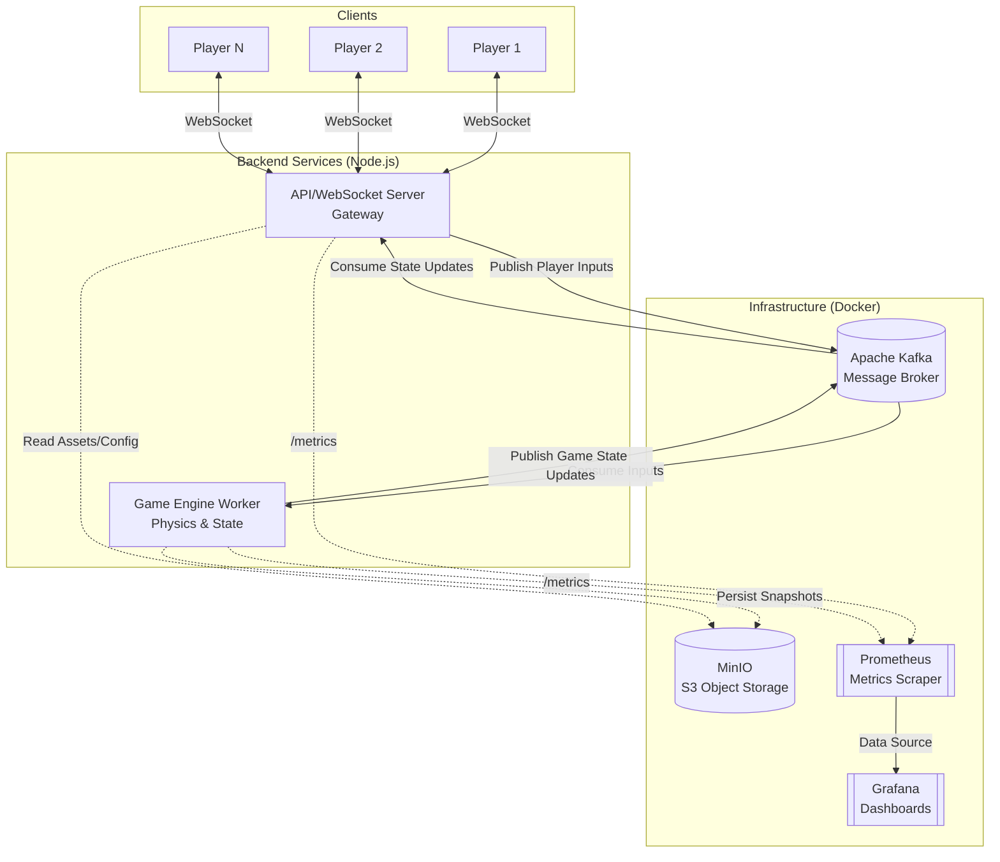

# 💣 DemolitionLabs

> **A high-concurrency real-time multiplayer grid-bombing game.**

DemolitionLabs is designed as a scalable, distributed systems playground disguised as a real-time multiplayer game. It leverages an event-driven architecture to achieve high concurrency, minimal latency, and robust fault tolerance.

---

## 🚀 Performance & Metrics

*Built for scale and observability. This section highlights the core engineering metrics.*

- **High Concurrency WebSockets**: Architecture designed and tested to easily handle **1,000+ concurrent connections** across multiple game rooms with minimal latency.
- **High Throughput Gameplay**: Clients sustain **10 ticks per second** (sending actions every 100ms) processed effectively by the backend game engine.
- **Event-Driven Backbone**: Incorporates **Apache Kafka** to decouple the API gateway (WebSocket Server) from the Game Engine (Worker), ensuring smooth scaling and ordered event processing.
- **Comprehensive Observability**: Out-of-the-box integration with **Prometheus** and **Grafana** for real-time monitoring of Node.js event loops, memory consumption, active connections, and Kafka message throughput.
- **Automated Load Testing**: Built-in scripts to simulate heavy traffic patterns and validate performance bottlenecks (`pnpm run load-test 1000`).

---

## 🏛️ System Architecture & Data Flow

The platform relies on a modern microservices architecture housed within a `pnpm` monorepo.



### 🔄 Data Flow Summary:
1. **Connection**: Clients establish a WebSocket connection to the **Server** (port 3001).
2. **Action**: Players send inputs (e.g., `MOVE NORTH`, `PLACE_BOMB`).
3. **Ingestion**: The Server acts as a gateway, validating payloads and publishing raw events to **Kafka**.
4. **Processing**: The **Worker** service consumes events from Kafka in order, runs the authoritative game engine logic, updates the internal game state, and publishes the new state back to Kafka.
5. **Broadcasting**: The Server consumes the new state from Kafka and broadcasts the optimized delta-updates to the connected Clients in the respective rooms.
6. **Persistence**: The Worker periodically takes snapshots of the game state and saves them to **MinIO**.

---

## 🛠️ Tech Stack

- **Core**: TypeScript, Node.js (v20+), `pnpm` Workspaces
- **Networking**: WebSockets (`ws`)
- **Messaging**: Apache Kafka
- **Storage**: MinIO (S3 Compatible)
- **Monitoring**: Prometheus, Grafana
- **Containerization**: Docker & Docker Compose

---

## ⚙️ Environment Variables

The project uses environment variables to configure URLs and credentials for seamless deployment across environments. For local development, it defaults to `localhost` URLs automatically, but you can override them using `.env` files in the respective packages.

**1. `packages/server/.env`**
```env
KAFKA_BROKERS=localhost:9092
```

**2. `packages/worker/.env`**
```env
KAFKA_BROKERS=localhost:9092
MINIO_ENDPOINT=http://localhost:9000
S3_BUCKET_NAME=demolition-replays
```

**3. `packages/client/.env`**
```env
VITE_WS_URL=ws://localhost:3001
VITE_REPLAY_URL=http://localhost:9000/demolition-replays
```

---

## 💻 Local Development Setup

Follow these steps to run the complete distributed architecture on your local machine.

### 1. Prerequisites
- [Node.js](https://nodejs.org/) (v20.0.0 or higher)
- [pnpm](https://pnpm.io/) (v9.0.0 or higher)
- [Docker & Docker Compose](https://www.docker.com/)

### 2. Start Infrastructure Services
Start Kafka, MinIO, Prometheus, and Grafana via Docker Compose:
```bash
docker-compose up -d
```
*Wait a few seconds for Kafka to initialize.*

### 3. Install Dependencies
Install packages for the entire monorepo:
```bash
pnpm install --frozen-lockfile
```

### 4. Run the Application
You will need to start the Server and the Worker. In development, you can run them in parallel:

**Start the WebSocket Server:**
```bash
pnpm --filter @demolition-labs/server dev
```

**Start the Game Engine Worker:**
```bash
pnpm --filter @demolition-labs/worker dev
```

**Start the Client:**
```bash
pnpm --filter @demolition-labs/client dev
```

*(Alternatively, if a root dev script is configured, simply run `pnpm run dev` from the root.)*

### 5. Accessing Services

- **WebSocket Server**: `ws://localhost:3001`
- **MinIO Console**: `http://localhost:9001` (User: `minioadmin`, Pass: `minioadmin`)
- **Prometheus**: `http://localhost:9090`
- **Grafana**: `http://localhost:3000` (User: `admin`, Pass: `admin`)

---

## 🧪 Load Testing

To run the built-in load test and bombard the server with emulated WebSocket clients:

```bash
# Simulates 1000 clients connecting and sending 10 inputs/second
pnpm run load-test 1000
```
Open Grafana during the load test to observe system performance under stress!
